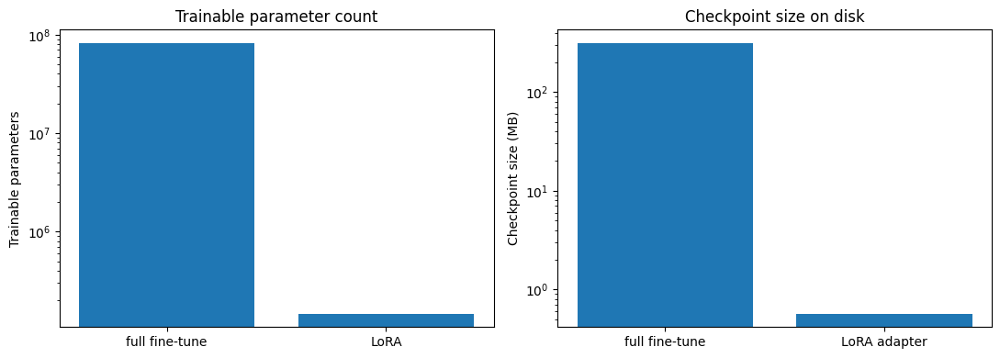
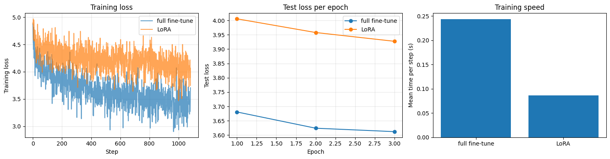
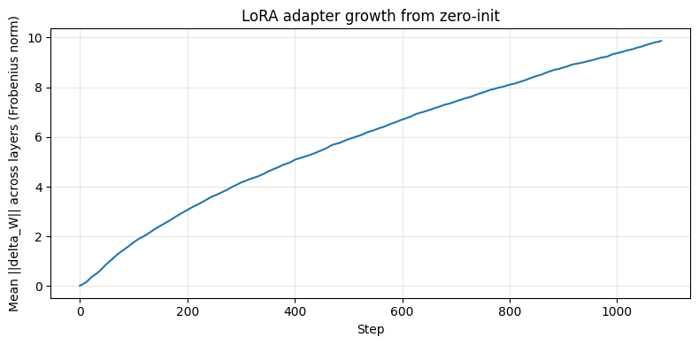

# LoRA: Low-Rank Adaptation of Large Language Models

Implementation and walkthrough of ["LoRA: Low-Rank Adaptation of Large Language Models"](LoRA%20-%20Low-Rank%20Adaptation%20of%20Large%20Language%20Models.pdf) (Hu, Shen, Wallis, Allen-Zhu, Li, Wang, Wang, Chen — ICLR 2022).

## The idea

Fine-tuning a pretrained weight matrix `W` normally means every parameter gets a gradient and an
optimizer state — expensive in compute, memory, and storage. LoRA freezes `W` entirely and learns
a small additive correction instead:

```
ΔW = (α/r) · A · B          h = xW + (α/r) · x·A·B
```

`A` is `in_features × r`, `B` is `r × out_features`, and `r` (here, 8) is tiny compared to the
real matrix dimensions. Only `A` and `B` are trainable. At initialization `A` is small random
noise and `B` is exactly zero, so `ΔW = 0` and the adapted model starts out identical to the
frozen base — training only ever moves the adapter away from a no-op.

The paper's own ablation finds adapting just the **query and value** projections beats spreading
the same parameter budget across all four attention matrices, so that's what's implemented here.
GPT-2 fuses q/k/v into one `c_attn` matrix, so the adapter targets the query and value thirds of
its output specifically, leaving the key third untouched.

## What's in this folder

| File | Purpose |
|---|---|
| `model.py` | `LoRAConv1D` (wraps a GPT-2 `Conv1D`, freezes the base weight, adds trainable low-rank `A`/`B` restricted to the q/v output slices), plus `inject_lora`/`setup_lora_model`/parameter-counting helpers — built from scratch, no `peft` |
| `train.py` | `train_step()`/`evaluate()` (causal LM loop), `current_memory_mb()` (MPS/CPU memory tracking), `save_checkpoint()`/`save_lora_adapters()` |
| `test_model.py`, `test_train.py` | 17 pytest unit tests covering the adapter math (zero-init, q/v-only, frozen base), injection/freezing, and the training loop — written before the real fine-tuning run |
| `lora.ipynb` | The paper walkthrough: explanation, from-scratch implementation, both fine-tuning runs, and all visualizations below |
| `design.md`, `plan.md` | The design spec and task-by-task implementation plan this was built from |
| `results/` | Saved per-step histories (`*_history.json`), generation samples, checkpoints, and exported plot images |

Base model: **DistilGPT-2** (82M params, 6 layers, hidden size 768, pretrained via `transformers`).

## Running it

```bash
python3 -m pytest test_model.py test_train.py -v   # 17 tests, no training required
jupyter nbconvert --to notebook --execute --inplace lora.ipynb
```

CIFAR-10 wasn't the only slow-download lesson from the previous paper — this one uses tiny
Shakespeare (`Trelis/tiny-shakespeare` on the HF Hub, 472/49 train/test rows) and DistilGPT-2
directly via `transformers`, both served from fast CDNs. Unlike the first paper in this repo
(stochastic depth), checkpoints and per-step metrics are persisted to `results/` **during**
training, every epoch — not just once at the end — so later analysis never requires a retrain.

## Results

Two identical fine-tuning runs on tiny Shakespeare (causal LM, block size 128, batch size 8, 3
epochs), differing only in what's trainable:

| Model | Trainable params | Checkpoint size | Final test loss | Mean time/step |
|---|---|---|---|---|
| Full fine-tune | 81,912,576 (99.8%) | 312.5 MB | 3.612 | 0.244s |
| LoRA (rank 8) | 147,456 (0.180%) | 0.57 MB | 3.927 | 0.087s |

**556x fewer trainable parameters, ~550x smaller checkpoint, ~2.8x faster per step** — and the
test loss is still within a reasonable margin of full fine-tuning's, exactly the paper's
"comparable quality, far less cost" claim:





**The adapter really does start at zero.** `ΔW = A·B`'s Frobenius norm is logged every step;
because it's logged at the *end* of each step's loop body, the first plotted point (0.0184) is
already after one gradient update — the exact zero-init property is verified separately and
precisely in `test_model.py::test_delta_norm_zero_at_init`, not just eyeballed from this plot:



## What the models actually generate

Same prompt (`"ROMEO:\nWhat light through yonder window breaks?"`), continuation from each model
at the end of every epoch:

**Full fine-tune, epoch 3:**
> ROMEO:
> A light that shines through the night,
> And shines through the night.
> ROMEO:
> A light that shines through the night,
> And shines through the

**LoRA, epoch 3:**
> ROMEO:
> KING RICHARD II:
> I am not a man, but a man.
> KING RICHARD II:
> I am not a man, but a man.

The clearest adaptation signal here is **structural, not stylistic**: both models pick up
play-script formatting (speaker tags like `LUCIUS:`, `KING RICHARD III:`, `KING LOUIS:`) that
wasn't in the prompt, showing the fine-tune did move the model toward the tiny Shakespeare format.
The generated text itself, though, is repetitive and degenerate rather than fluent Shakespearean
prose — getting coherent, varied Shakespearean language out of this would likely need a bigger
base model and/or more epochs than this scoped-down demo runs for. Worth stating plainly rather
than overselling a clean stylistic win that didn't quite happen at this scale.

## A process note

This paper's design deliberately persists checkpoints and per-step metrics *during* training,
after the previous paper (stochastic depth) had to work around losing that data entirely — a
lesson that paid off directly here too: a code review caught that the persistence calls had
ended up outside the per-epoch loop (writing only once, after all 3 epochs), which would have
reproduced the exact same gap. Caught and fixed before merge, verified by re-running the full
training end to end.
