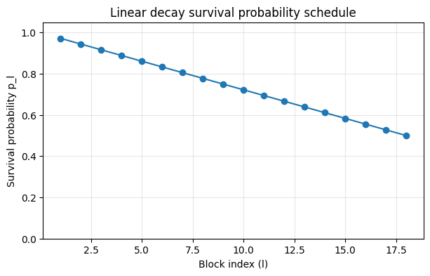
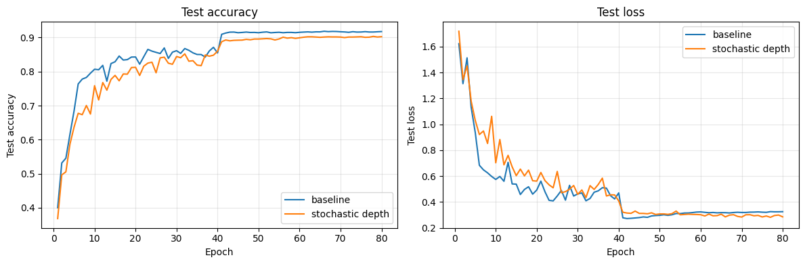
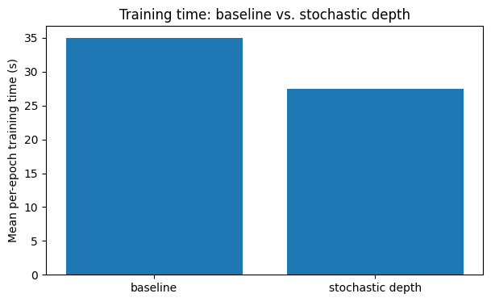
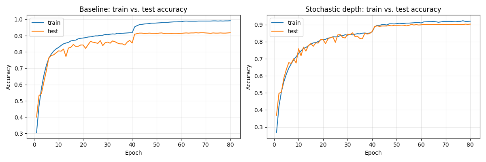
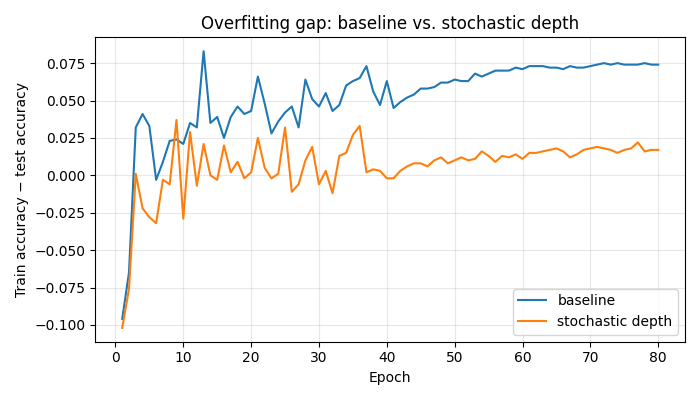
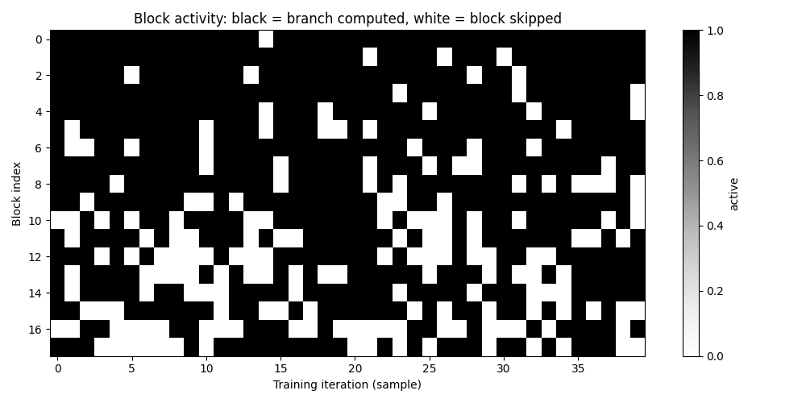

# Deep Networks with Stochastic Depth

Implementation and walkthrough of ["Deep Networks with Stochastic Depth"](Deep%20Networks%20with%20Stochastic%20Depth.pdf) (Huang, Sun, Liu, Sedra, Weinberger — ECCV 2016).

## The idea

A standard residual block computes `H = ReLU(x + f(x))`. Stochastic depth adds a per-block coin
flip during training:

- **Training:** `H = ReLU(x + b·f(x))`, `b ~ Bernoulli(p_l)`. When the flip is 0, `f(x)` (the conv
  branch) is **not computed at all** — the block becomes a pure identity passthrough, a real
  compute saving.
- **Eval:** `H = ReLU(x + p_l·f(x))` — every block runs, scaled by its survival probability so the
  expected output matches training.
- **Schedule:** survival probability decays linearly with depth, `p_l = 1 - (l/L)(1 - p_L)`. Early
  blocks survive almost always; deep blocks are dropped often (`p_L = 0.5` here, the paper's
  default).



## What's in this folder

| File | Purpose |
|---|---|
| `model.py` | `survival_probabilities()`, `ConvBranch`, `StochasticDepthBlock`, `ResNetCIFAR` — the mechanism, built from scratch (no `torchvision.ops.StochasticDepth`) |
| `train.py` | `train_one_epoch()` / `evaluate()` training and eval loops |
| `test_model.py`, `test_train.py` | 21 pytest unit tests covering the gating logic, schedule, and training loop, written before any real training run |
| `stochastic_depth.ipynb` | The paper walkthrough: explanation, from-scratch implementation, training run, and all visualizations below |
| `design.md`, `plan.md` | The design spec and task-by-task implementation plan this was built from |
| `results/` | Saved metrics (`*_history.json`) and exported plot images |

Model: a small CIFAR-style ResNet, 3 stages (16→32→64 channels) × 6 blocks = **18 residual
blocks** (~38 weight layers) — small enough to train on a laptop, in the family of the smaller
configs the paper itself evaluates.

## Running it

```bash
python3 -m pytest test_model.py test_train.py -v   # 21 tests, no training required
jupyter nbconvert --to notebook --execute --inplace stochastic_depth.ipynb
```

CIFAR-10 loads via the Hugging Face `datasets` library (`uoft-cs/cifar10`) rather than
torchvision's direct download, which points at a very slow origin server — this alone was the
difference between an ~11-second load and a 50+ minute one.

## Results

Two identical models (SGD, momentum 0.9, weight decay 1e-4, step LR decay at epochs 40/60),
80 epochs each on CIFAR-10, differing only in whether stochastic depth is on:

| Model | Final test acc | Final train acc | Total train time |
|---|---|---|---|
| Baseline | 91.8% | 99.2% | 2799.1s (~46.7 min) |
| Stochastic depth | 90.3% | 92.0% | 2199.8s (~36.7 min) |



**Speed:** stochastic depth trained **21% faster** overall — the direct effect of skipping the
conv branch on gated-off blocks.



**Regularization:** the raw accuracy numbers undersell what's actually happening. Baseline's
train accuracy climbs to 99.2% while test accuracy plateaus at 91.8% — a 7.4-point train/test
gap, classic overfitting. Stochastic depth's train and test accuracy stay close together
throughout (92.0% vs. 90.3%, a 1.7-point gap), even though it hasn't caught up to baseline on raw
test accuracy within this budget:





This is the paper's implicit-ensemble/regularization claim showing up directly in the numbers:
each block sees fewer effective gradient updates over training, acting more like an ensemble of
shallower networks than one very deep one. The paper's own accuracy gains over a plain baseline
show up over hundreds of epochs on much deeper (110+ layer) networks — at 18 blocks and 80
epochs, the speed and regularization effects are already clearly visible; fully closing (and
reversing) the raw accuracy gap would need a larger compute budget than this scoped-down demo
targets.

**Block dropping in action** — 40 sampled iterations, one row per block, black = branch computed,
white = skipped. Early blocks (top, block 0) are almost always active; late blocks (bottom, block
17) are dropped roughly half the time, matching the schedule above:


